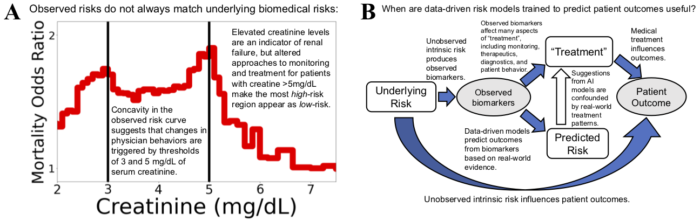

[Death by Round Numbers and Sharp Thresholds: How to Avoid Dangerous AI EHR Recommendations](https://www.medrxiv.org/content/10.1101/2022.04.30.22274520v1)

Biases in medical practice around round numbers lead to measurable increases in mortality rates. We can use the high-resolution interpretable machine learning models to uncover these biases and identify opportunities to improve clinical practice.

If you use these ideas, code, or results, please cite:
```
@article{lengerich2022death,
  title={Death by Round Numbers and Sharp Thresholds: How to Avoid Dangerous AI EHR Recommendations},
  author={Lengerich, Benjamin J and Caruana, Rich and Nunnally, Mark E and Kellis, Manolis},
  journal={medRxiv},
  year={2022},
  publisher={Cold Spring Harbor Laboratory Press}
}
```
The manuscript is currently available on [Medrxiv](https://www.medrxiv.org/content/10.1101/2022.04.30.22274520v1). 


Figure 1: Real-world confounding factors are treacherous to data-driven risk models, especially when data-driven
risk models are intended to be used to guide treatment decisions. (A) The mortality risk of pneumonia patients
suggests that high levels of serum creatinine (which indicate kidney failure) are associated with better survival, even
after correcting for other risk factors in a multivariable predictive model. The sharp inflection points in mortality
odds ratio at the round numbers of 3mg/dL and 5mg/dL suggest that this association between elevated creatinine and
reduced mortality is prompted by discrete treatment thresholds rather than smooth biomedical risk factors. While this
confounding between risk factor and clinical decisions is a challenge for data-driven analysis (a naïve triage model
would withhold treatment from patients with elevated serum creatinine, precisely those who most need treatment), it
is also a blessing: the non-monotonicity alerts us to an opportunity to optimize treatment protocols. (B) Causal flow
underlying “treatment” effects. Causal arrows are filled, observed variables are shown in gray ovals and unobserved
variables in white boxes. Data-driven analyses often estimate P(Outcome|Biomarker), but this is only a faithful
surrogate for P(Outcome|Underlying Risk) if treatments were to have negligible impacts on the outcome. In reality,
treatments (broadly defined, including monitoring, therapeutics, diagnostics, and patient behavior) have significant
impacts and frequently lead to “paradoxical” effects in which data-driven systems assign low risk to high-risk patients
precisely because the high-risk patients are most likely to be effectively treated. To build models which can effectively
guide treatment decisions, we require intelligible models and medical domain knowledge to audit the probabilistic
models and understand if all relevant treatment effects have been sufficiently corrected.
