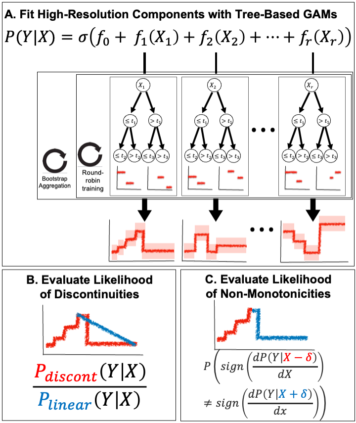
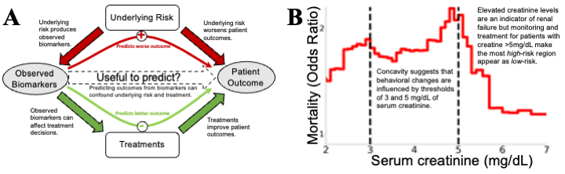

# [Death by Round Numbers: Glass-Box Machine Learning Uncovers Biases in Medical Practice](https://www.medrxiv.org/content/10.1101/2022.04.30.22274520v2)

Real-world evidence is confounded by treatments, so data-driven systems can learn to recapitulate biases that influenced treatment decisions. This confounding presents a challenge: uninterpretable black-box systems can put patients at risk by confusing treatment benefits with intrinsic risk, but also an opportunity: interpretable “glass-box” models can improve medical practice by highlighting unexpected patterns which suggest biases in medical practice.

This repo contains examples of how to find these statistical artifacts and biases in a pneumonia dataset and MIMIC-II, MIMIC-III< and MIMIC-IV.

## Automated Search for Statistical Artifacts

It makes use of two automated tools:
- `find_and_plot_discontinuities`, which automatically finds discontinuous effects in your data.
- `find_and_plot_non_monotonicities`, which automatically finds non-monotone effects in your data.

Both of these tools are available in the [https://github.com/blengerich/ebm_utils](ebm_utils) package. This package can be installed via:
`pip install git+https://github.com/blengerich/ebm_utils`. And the tools are located in `ebm_utils.analysis.changepoints`.





## Citing

If you use these ideas, code, or results, please cite:
```
@article{lengerich2022death,
  title={Death by Round Numbers: Glass-Box Machine Learning Uncovers Biases in Medical Practice},
  author={Lengerich, Benjamin J and Caruana, Rich and Nunnally, Mark E and Kellis, Manolis},
  journal={medRxiv},
  year={2022},
  publisher={Cold Spring Harbor Laboratory Press}
}
```
The manuscript is currently available on [Medrxiv](https://www.medrxiv.org/content/10.1101/2022.04.30.22274520v2). 


Figure 1: Confounding effects are treacherous to data-driven risk models, but confounding effects that are revealed by
glass-box models can be useful by suggesting potential improvements in medicine. (A) Underlying “treatment effects”
confound risk models. Causal arrows are filled, observed variables are shown in gray ovals and unobserved variables
in white boxes. Data-driven analyses often estimate P(Outcome|Biomarker), but this is only a faithful surrogate
for P(Outcome|Underlying Risk) if treatments were to have negligible impacts. In reality, treatments (broadly interpreted, including monitoring, therapeutics, diagnostics, and patient behavior) have large impacts on outcomes. When
explicitly analyzed for treatment effectiveness, effects of randomly-assigned treatments are desirable as evidence of a
proposed treatment being effective, but strong treatment effects confound estimation of risk. To build models which
can effectively guide treatment decisions, we require intelligible models and medical domain knowledge to understand
if all relevant confounders have been sufficiently corrected. (B) An example of strong, but useful, confounding: the
mortality risk of pneumonia patients falls with extremely high levels of serum creatinine (which indicates kidney failure), even after correcting for other risk factors in a multivariable predictive model. This counter-causal relationship
suggests confounding, and the sharp inflections at the round numbers of 3mg/dL and 5mg/dL (denoted by black vertical lines) suggest that this association is guided by discrete treatment thresholds rather than smooth biomedical risk
factors. While this confounding between risk factor and clinical decisions is a challenge for data-driven analysis, it is
also an opportunity because the unexpected inflections alert us to possibilities of optimizing treatment
